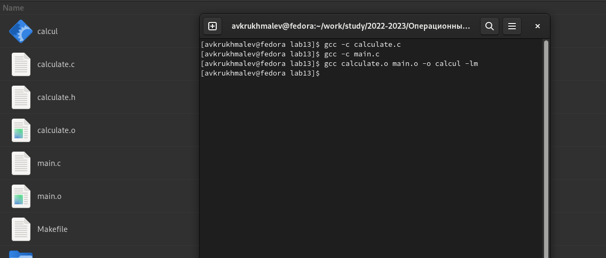
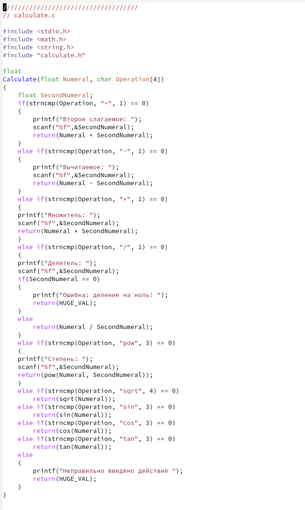
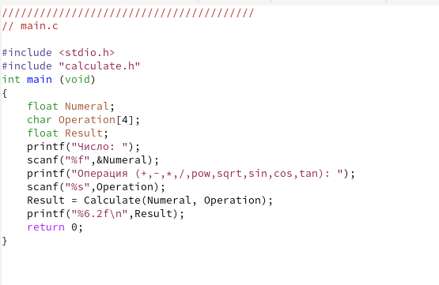

---
## Front matter
lang: ru-RU
title: Лабораторная работа 14
author:
  - Коц Д.Б.
institute:
  - Российский университет дружбы народов, Москва, Россия
date: 12 мая 2023

## i18n babel
babel-lang: russian
babel-otherlangs: english

## Formatting pdf
toc: false
toc-title: Содержание
slide_level: 2
aspectratio: 169
section-titles: true
theme: metropolis
header-includes:
 - \metroset{progressbar=frametitle,sectionpage=progressbar,numbering=fraction}
 - '\makeatletter'
 - '\beamer@ignorenonframefalse'
 - '\makeatother'
---

## Цель работы

Изучить основы программирования в оболочке ОС UNIX/Linux. Научиться писать командные файлы.

## Задание

Написать программы

# Выполнение лабораторной работы

## Создал файлы, запустил их

{ #fig:001 width=70% }

## вывод работы сервера

{ #fig:002 width=70% }

## server.c

{ #fig:003 width=70% }

## Выводы

Научился писать небольшие командные файлы

